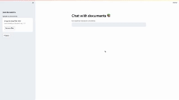

# Chat-with-Docs

 - To run the app first download the code, create a venv and install the dependencies. 

 ```
 pip install -r requirnments.txt
 
 ```


 ## Install the ollama cli and application on your local system. Once running you can run ollama commands on the system.

 - Ollama is a streamlined tool for running open-source LLMs locally like mistral, llama2 etc. 

 ```
 ~/Doc/S/data-science/chat-with-pdf   main !1 ❯ ollama -v                                                                               
  ollama version is 0.1.29

 ```


## Pull the LLM model of your choice using ollama cli. 

- here I am pulling a nomic-embed-text model .

```
~ ❯ ollama pull nomic-embed-text     

pulling 970aa74c0a90... 100% ▕██████████████████████████████████████████████████████████████████████████████████▏ 274 MB
pulling c71d239df917... 100% ▕██████████████████████████████████████████████████████████████████████████████████▏  11 KB
pulling ce4a164fc046... 100% ▕██████████████████████████████████████████████████████████████████████████████████▏   17 B
pulling 31df23ea7daa... 100% ▕██████████████████████████████████████████████████████████████████████████████████▏  420 B
verifying sha256 digest
writing manifest
removing any unused layers
success

~ ❯ ollama list         

NAME                   	ID          	SIZE  	MODIFIED
codellama:latest       	8fdf8f752f6e	3.8 GB	8 days ago
llama2:latest          	78e26419b446	3.8 GB	8 days ago
mistral:latest         	61e88e884507	4.1 GB	9 days ago
mixtral:latest         	7708c059a8bb	26 GB 	9 days ago
nomic-embed-text:latest	0a109f422b47	274 MB	9 seconds ago

```

## Change the model of your choice in the application by chaning the paramter in app.py

- model = os.environ.get("MODEL", "mistral")

## Run the application with the commmand 

```
~/Doc/S/data-science/chat-with-pdf   main !1 ❯ streamlit run app.py                  

  You can now view your Streamlit app in your browser.

  Local URL: http://localhost:8501
  Network URL: http://192.168.0.9:8501


```

## Running application Demo:




